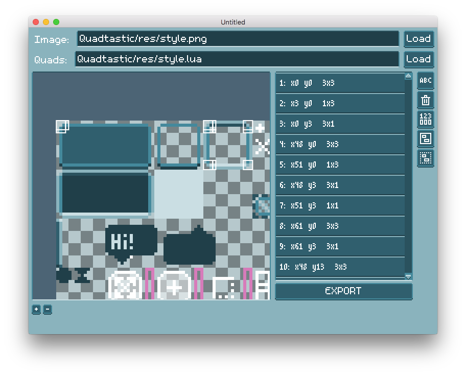

# Quadtastic!

This is a little LÖVE tool to handle sprite atlases while keeping your sanity.




## Usage

 - Load an image either by using the file browser or dragging the image onto the
   app's window
 - Define new quads by dragging rectangles on your spritesheet
 - Name your quads to make it easier to access them
 - When you're done, export the generated quads. This will produce a `.lua` file
   that looks something like this:

```lua
	return {
		head = {x = 3, y = 3, w = 16, h = 16},
		body = {x = 2, y = 22, w = 16, h = 32},
		legs = {x = 3, y = 58, w = 16, h = 16},
	}
```

This allows you to import and use the quads like so:

```lua
	 -- do this once in love.load
	local quads = import_quads(require("path-to-quadfile"), 
							   image:getWidth(), image:getHeight())

	 -- do this whenever you want to draw the quads (obviously...)
	love.graphics.draw(image, quads.head, 2, 0)
	love.graphics.draw(image, quads.legs, 2, 47)
	love.graphics.draw(image, quads.body, 0, 15)
```

You can also use this tool to create color palettes. The command
`import_palette` will take the upper left pixel of each defined quad and store
its rgb value.

```lua
	-- do this once in love.load
	local palette = import_palette(require("path-to-quadfile"), image)

	-- then you can use the color like this:
	love.graphics.clear(palette.sky)
	love.graphics.setColor(palette.sun)
	love.graphics.circle("fill", 400, 100, 50)
```

## Roadmap

 - [x] Select a file
 - [x] Load the image
 - [x] Display the image
 - [x] zoom and move the image around
 - [x] Define quads
 - [x] Name quads
 - [x] Delete and modify existing quads
 - [x] Export defined quads as lua code
 - [x] Detect and import existing quad definitions
 - [x] Group quads
 - [x] Highlight selected and hovered quads
 - [x] Display name of quads in ImageEditor
 - [x] Use dot notation in quad names to move them to quad groups
 - [x] Scroll quad list viewport to created or modified quad
 - [x] Scroll image editor viewport to clicked quad
 - [x] Fix scroll bars not displaying in image editor
 - [x] Implement scroll bars
 - [x] Use CTRL+Mousewheel to zoom
 - [x] Use MMB to pan image
 - [ ] Drag and drop quads in the quad list to form groups
 - [ ] Distribution:
    - [ ] License
    - [x] Automatically put version and commit hash in plist
    - [x] MacOS
    - [ ] Windows 32 bit
    - [ ] Windows 64 bit
    - [ ] Linux
    - [ ] Icon
    - [ ] Show Quadtastic in title bar
 - [ ] Detect when an image changed on disk
 - [ ] Make Load button glow when file changed on disk
 - [ ] Make Export button glow when quads have changed since last export
 - [ ] Show confirmation dialog when the user would lose changes by loading a
       new image or quad file
 - [ ] Test palette feature in libquadtastic
 - [ ] Adjust center of the viewport after zooming
 - [ ] Add file browser
 - [ ] Add info next to zoom level: size of currently drawn quad
 - [ ] Add text area that wraps at layout boundary automatically
 - [ ] Outline quads with a color that maximizes contrast (i.e. white for darker
       areas, black for brighter areas). The most efficient way to do this is
       probably by creating a canvas with the image's size that is black in all
       bright areas of the canvas, and white in all dark areas. When we then
       draw the the outline, we use a shader that samples the pre-processed
       image. The outline uses the color of the pixel that is being outlined.
 - [ ] Add toolbar with tools:
    - [ ] The Create tool to create new quads
    - [ ] The Select tool to select, move and resize quads
    - [ ] The Border tool to create border quads
    - [ ] The Strip tool to create strips of equally sized quads
 - [ ] Undo/Redo history
 - [ ] Export quads in consistent order. The current export method is somewhat
       random, which causes the output to change even if the quad definitions
       stayed the same
 - [ ] Overhaul dialog texts
 - [ ] Fix detection of quads: Currently the application treats all tables as
       quads that have values for x, y, w, and h. This means that you cannot
       have a group that contains the entire alphabet, since that group could
       have quads named x, y, w and h. Solution: Introduce a sneaky key _type
       that identifies the type of element. Unfortunately, we will have to
       include that key in the exported quad file, since we otherwise run into
       the same problem when using the quads.
 - [ ] Make quad list prettier
 - [x] Make quad groups in quad list collapsible and expandable
 - [ ] >>>>>>> TURBO-WorkflOw >>>>>
	 - [ ] Automatically reload image when it changes on disk
	 - [ ] Automatically export new quad file whenever quads are changed

# Credits and tools used

 - [LÖVE](https://love2d.org/), obviously
 - The [m5x7](https://managore.itch.io/m5x7) and [m3x6](https://managore.itch.io/m3x6)
   fonts by Daniel Linssen
 - [aseprite](https://www.aseprite.org/) by David Kapello.
   Oh, also, the pixelated Quadtastic UI is my lousy attempt to create something
   similar to the gorgeous UI in aseprite.
 - [luafilesystem](https://github.com/keplerproject/luafilesystem)
 - [lovedebug](https://github.com/Ranguna/LOVEDEBUG) by kalle2990, maintained by Ranguna
 - [Nuklear](https://github.com/vurtun/nuklear) for guidance on how to write IMGUI
 - [inspect.lua](http://github.com/kikito/inspect.lua) by kikito
 - affine for reverse transformation by [Minh Ngo](https://github.com/markandgo/simple-transform)
 - xform by [pgimeno](https://love2d.org/forums/viewtopic.php?p=201884#p201884)
   for practical ideas related to reverse transformation
