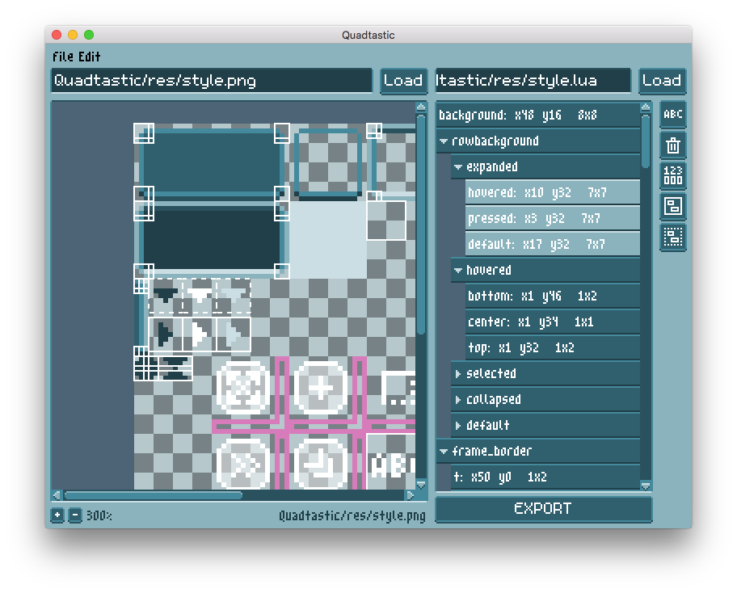
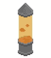
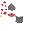

<h1 align="center">Quadtastic!</h1>

<p align="center">
  A little standalone tool to manage sprite sheets and color palettes for
  <a href="https://www.love2d.org">LÖVE</a> projects.
</p>

<p align="center">
  
</p>

<p align="center">
  <a href="https://25a0.itch.io/quadtastic">
    
  </a>
</p>


## Usage

### Defining quads

 - Load an image either by dragging the image into the app's window, or via the
   menu: "Image" -> "Open Image..."
 - Define new quads by dragging rectangles on your spritesheet, using the "Create" tool
 - Name your quads to make it easier to access them
 - Select, move and resize existing quads using the "Select" tool
 - Create groups of quads to organize them hierarchically
 - When you're done, export or save the generated quads. This will produce a
   quadfile; a `.lua` file containing the generated quads.
   It looks something like this:

```lua
  return {
    head = {x = 3, y = 3, w = 16, h = 16},
    body = {x = 2, y = 22, w = 16, h = 32},
    legs = {x = 3, y = 58, w = 16, h = 16},
  }
```

 - As you expand your spritesheet, you can re-open this quadfile in Quadtastic
   to add or modify quads
 - Enable  to reload the
   spritesheet whenever it changes on disk, and to re-export the quads whenever
   you change them

### Using quads

If you don't feel like reading a lot, you can also just tinker around with the
[example project](#example-project) below.

#### Accessing quads from LÖVE

Once you have saved the quads in a quadfile, you can access them from your LÖVE
project:

```lua
  -- assuming that your quads are saved in "res/quads.lua"
  local raw_quads = require("res/quads")
```

Alternatively you can use the LÖVE filesystem module:

```lua
  -- assuming that your quads are saved in "res/quads.lua"
  -- note the extra parentheses at the end, which are necessary to run the loaded file
  local raw_quads = love.filesystem.load("res/quads.lua")()
```

Or use [Cargo](https://github.com/bjornbytes/cargo):

```lua
  -- assuming that your quads are saved in "res/quads.lua"
  local res = require("cargo").init("res")
  local raw_quads = res.quads
```

Either way, this loads the raw quad definitions:

```lua
  for k, v in pairs(raw_quads) do
    print(k, v.x, v.y, v.w, v.h)
  end
  --[[
  with the example quads above, this prints:
  head  3 3 16  16
  body  2 22 16  32
  legs  3 58 16  16
  ]]

```

#### `libquadtastic`

Quadtastic comes with a library called `libquadtastic`, which offers a few
functions that make it easier to use the defined quads and palettes in your
LÖVE project. Details about these functions are explained in the next sections.
Except for some LÖVE functions, this library has no external
dependencies.

You can download the latest version of `libquadtastic` [here](https://raw.githubusercontent.com/25A0/Quadtastic/master/Quadtastic/libquadtastic.lua),
or use the help menu in Quadtastic to access the version of `libquadtastic` that
is guaranteed to be compatible with the version of Quadtastic that you are using.

Remember that the quadfile is basically a lua table. So, if you do not want to
use `libquadtastic`, or you need additional functionality, you can just import
the raw quads with `require`, and handle them however you like.

Keep in mind though that Quadtastic is still in development, and the format of
the quadfiles might change without warning until version 1.0 is released.

#### Drawing quads

`libquadtastic` contains a function to generate a LÖVE quad object for each
quad in your quadfile:

```lua
  local libquadtastic = require("libquadtastic")

  -- do this once in love.load
  local image = love.graphics.newImage("path/to/spritesheet")
  local quads = libquadtastic.import_quads(require("path/to/quadfile"),
                                           image:getWidth(), image:getHeight())

   -- do this whenever you want to draw the quads
  love.graphics.draw(image, quads.head, 2, 0)
  love.graphics.draw(image, quads.legs, 2, 47)
  love.graphics.draw(image, quads.body, 0, 15)
```

You can just as easily use them with a spritebatch:

```lua
  local libquadtastic = require("libquadtastic")

  -- do this once in love.load
  local image = love.graphics.newImage("path/to/spritesheet")
  local quads = libquadtastic.import_quads(require("path/to/quadfile"),
                                           image:getWidth(), image:getHeight())
  local spritebatch = love.graphics.newSpritebatch(image, 1024)

   -- do this whenever you want to draw the quads
  spritebatch:add(quads.head, 2, 0)
  spritebatch:add(quads.legs, 2, 47)
  spritebatch:add(quads.body, 0, 15)

  love.graphics.draw(spritebatch)
  spritebatch:clear()
```

#### Using Palettes

You can also use this tool to create color palettes. The command
`import_palette` will take the upper left pixel of each defined quad and store
its RGBA value.

```lua
  local libquadtastic = require("libquadtastic")
  -- do this once in love.load
  local image = love.graphics.newImage("path/to/palettesheet")
  local all_quads = require("path-to-quadfiles")
  -- assuming that the group 'palette' contains your color palette
  local palette = libquadtastic.import_palette(all_quads.palette, image)

  -- then you can use the color like this:
  love.graphics.clear(palette.sky)
  love.graphics.setColor(palette.sun)
  love.graphics.circle("fill", 400, 100, 50)
```

The colors are stored as tables containing the RGBA values in range 0-255.
These tables are callable to make it easy to change the alpha value on the fly.
That means that you can do this

```lua
  love.graphics.setColor(palette.highlight(128))
```

instead of

```lua
  local transparent_highlight = palette.highlight
  transparent_highlight[4] = 128
  love.graphics.setColor(transparent_highlight)
```

## Download

You can find executables of Quadtastic for Windows and OS X [on itch.io](https://25a0.itch.io/quadtastic), as well as a cross-platform `.love` archive.

While the executable versions should run out of the box, **the `.love` version
requires [LuaFileSystem](keplerproject.github.io/luafilesystem/)**.
If you have [luarocks](https://luarocks.org/) installed, you can install LuaFileSystem with
```
  luarocks install luafilesystem
```

## Example project

Here is a toy project that draws this ugly lava lamp:

<p align="center">
  
</p>

Clone this repo, run `love example`, and contemplate what the 60s must have been like.

`example/res/sheet.png`:



`example/res/quads.lua`, generated with Quadtastic:

```lua
local t = {}
t["_META"] = {}
t["_META"]["image_path"] = "/Users/moritz/Projects/Quadtastic/example/res/sheet.png"

t["base"] = {x = 16, y = 27, w = 16, h = 8}
t["bubbles"] = {}
t["bubbles"][1] = {x = 2, y = 18, w = 5, h = 5}
t["bubbles"][2] = {x = 1, y = 25, w = 3, h = 4}
t["bubbles"][3] = {x = 10, y = 18, w = 5, h = 3}
t["bubbles"][4] = {x = 7, y = 24, w = 7, h = 6}
t["bubbles"][5] = {x = 3, y = 8, w = 5, h = 4}
t["bubbles"][6] = {x = 10, y = 11, w = 4, h = 3}
t["bubbles"][7] = {x = 7, y = 3, w = 6, h = 4}

t["lid"] = {x = 16, y = 7, w = 16, h = 15}
t["liquid"] = {x = 0, y = 32, w = 3, h = 3}
t["stand"] = {x = 32, y = 32, w = 16, h = 16}
return t
```

`example/main.lua`:
```lua
local libquadtastic = require("libquadtastic")

local image, raw_quads, quads, liquid
local bubble_pos
local tube = {x = (400-14) / 2, y = (300 - 30) / 2, w = 14, h = 30}

function love.load()
  love.graphics.setDefaultFilter("nearest", "nearest")

  raw_quads = require("res/quads") -- load raw quad definitions
  image = love.graphics.newImage("res/sheet.png") -- load spritesheet

  -- Create LOVE Quads from raw quad definitions
  quads = libquadtastic.create_quads(raw_quads, image:getWidth(), image:getHeight())
  -- Extract color value from spritesheet. In this case we just extract a single
  -- color, but we could also pass in a table of quads.
  liquid = libquadtastic.create_palette(raw_quads.liquid, image)

  bubble_pos = {}
  for i, raw_bubble in ipairs(raw_quads.bubbles) do
    bubble_pos[i] = {
      x = tube.x + love.math.random(0, tube.w - raw_bubble.w),
      y = 0,
      time_delta = love.math.random(0, 2*math.pi)
    }
  end
end

function love.draw()
  love.graphics.scale(2, 2)
  love.graphics.clear(255, 255, 255)

  love.graphics.draw(image, quads.base, tube.x - 1, tube.y + tube.h - raw_quads.base.h)

  for i=1,#quads.bubbles do
    love.graphics.draw(image, quads.bubbles[i], bubble_pos[i].x, bubble_pos[i].y)
  end

  love.graphics.setColor(liquid)
  love.graphics.rectangle("fill", tube.x, tube.y, tube.w, tube.h)

  love.graphics.setColor(255, 255, 255, 255)
  love.graphics.draw(image, quads.stand, tube.x - 1, tube.y + tube.h - 3)
  love.graphics.draw(image, quads.lid, tube.x - 1, tube.y + 3 - raw_quads.lid.h)
end

function love.update()
  for i, pos in ipairs(bubble_pos) do
    pos.y = math.floor(tube.y + (tube.h/2 - 2) * (1 + math.sin(pos.time_delta + love.timer.getTime() / 4)))
    pos.x = math.floor(tube.x + ((tube.w - raw_quads.bubbles[i].w)/2) * (1 + math.sin(pos.time_delta + love.timer.getTime() / 8)))
  end
end
```

## [Changelog](./changelog.md)

## Credits and tools used

 - [LÖVE](https://love2d.org/)
 - The [m5x7](https://managore.itch.io/m5x7) and [m3x6](https://managore.itch.io/m3x6)
   fonts by Daniel Linssen
 - [aseprite](https://www.aseprite.org/) by David Kapello.
   Oh, also, the pixelated Quadtastic UI is my lousy attempt to create something
   similar to the gorgeous UI in aseprite.
 - [luafilesystem](https://github.com/keplerproject/luafilesystem)
 - [lovedebug](https://github.com/Ranguna/LOVEDEBUG) by kalle2990, maintained by Ranguna
 - [Nuklear](https://github.com/vurtun/nuklear) for guidance on how to write IMGUI
 - affine for reverse transformation by [Minh Ngo](https://github.com/markandgo/simple-transform)
 - xform by [pgimeno](https://love2d.org/forums/viewtopic.php?p=201884#p201884)
   for practical ideas related to reverse transformation
