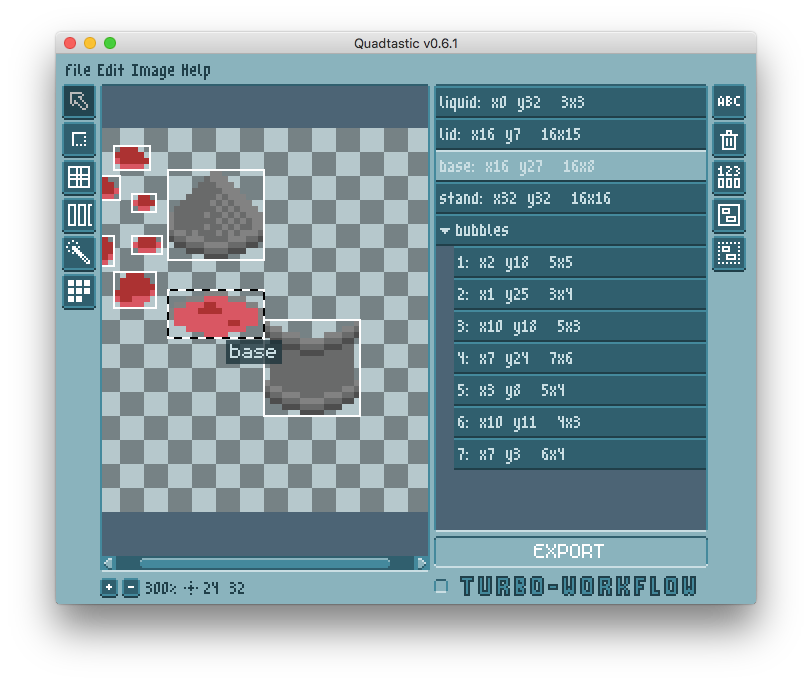

# Quadtastic!

This is a little standalone LÖVE tool to manage sprite sheets and color palettes.




## Usage

 - Load an image either by using the file browser or dragging the image onto the
   app's window
 - Define new quads by dragging rectangles on your spritesheet
 - Name your quads to make it easier to access them
 - When you're done, export the generated quads. This will produce a `.lua` file
   that looks something like this:

```lua
	return {
		head = {x = 3, y = 3, w = 16, h = 16},
		body = {x = 2, y = 22, w = 16, h = 32},
		legs = {x = 3, y = 58, w = 16, h = 16},
	}
```

This allows you to import and use the quads like so:

```lua
	 -- do this once in love.load
	local quads = import_quads(require("path-to-quadfile"), 
							   image:getWidth(), image:getHeight())

	 -- do this whenever you want to draw the quads (obviously...)
	love.graphics.draw(image, quads.head, 2, 0)
	love.graphics.draw(image, quads.legs, 2, 47)
	love.graphics.draw(image, quads.body, 0, 15)
```

You can also use this tool to create color palettes. The command
`import_palette` will take the upper left pixel of each defined quad and store
its rgb value.

```lua
	-- do this once in love.load
	local palette = import_palette(require("path-to-quadfile"), image)

	-- then you can use the color like this:
	love.graphics.clear(palette.sky)
	love.graphics.setColor(palette.sun)
	love.graphics.circle("fill", 400, 100, 50)
```

The colors are stored as tables containing the rgba values in range 0-255.
These tables are callable to make it easy to change the alpha value on the fly.
That means that you can do this
```lua
  love.graphics.setColor(palette.highlight(128))
```
instead of
```lua
  local transparent_highlight = palette.highlight
  transparent_highlight[4] = 128
  love.graphics.setColor(transparent_highlight)
```

## [Changelog](./changelog.md)

# Credits and tools used

 - [LÖVE](https://love2d.org/), obviously
 - The [m5x7](https://managore.itch.io/m5x7) and [m3x6](https://managore.itch.io/m3x6)
   fonts by Daniel Linssen
 - [aseprite](https://www.aseprite.org/) by David Kapello.
   Oh, also, the pixelated Quadtastic UI is my lousy attempt to create something
   similar to the gorgeous UI in aseprite.
 - [luafilesystem](https://github.com/keplerproject/luafilesystem)
 - [lovedebug](https://github.com/Ranguna/LOVEDEBUG) by kalle2990, maintained by Ranguna
 - [Nuklear](https://github.com/vurtun/nuklear) for guidance on how to write IMGUI
 - affine for reverse transformation by [Minh Ngo](https://github.com/markandgo/simple-transform)
 - xform by [pgimeno](https://love2d.org/forums/viewtopic.php?p=201884#p201884)
   for practical ideas related to reverse transformation
