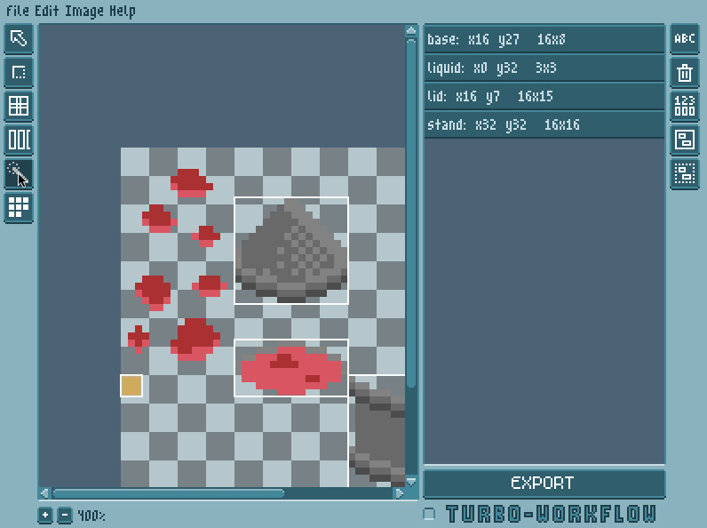

<h1 align="center">Quadtastic!</h1>

<p align="center">
  A simple standalone tool to manage sprite sheets and color palettes
</p>

<p align="center">
  
</p>

<p align="center">
  <a href="https://25a0.itch.io/quadtastic">
    
  </a>
</p>

<p align="center">
  <a href="https://github.com/25a0/Quadtastic/wiki">
    
  </a>
</p>

## Features

 - Create quads straight on your sprite sheet -- no need to ever type out coordinates again
 - Keep your quads neatly organized by giving them descriptive names and grouping them
 - Move and resize existing quads
 - Use the wand tool to create quads from opaque areas automatically
 
 - Use the palette tool to create quads from areas that have the same color
 
 - Learn more about how to [**use Quadtastic**](https://github.com/25a0/Quadtastic/wiki/Using-Quadtastic)
 - Save quads as a simple lua table, export them to [other formats](https://github.com/25A0/Quadtastic/blob/master/Exporter/README.md)
   like JSON or XML, or [create your own exporter](https://github.com/25a0/Quadtastic/wiki/Exporters).
 - Enable  to reload the
   spritesheet whenever it changes on disk, and to re-export the quads whenever
   you change them

If you're using [LÖVE](https://www.love2d.org):

 - Save your quads as a lua table, and turn them into LÖVE Quad objects with just a
   few lines of code

    ```lua
    -- load the raw quad definitions that you created with Quadtastic
    local raw_quads = require("res/quads")
    image = love.graphics.newImage("res/sheet.png") -- load spritesheet

    -- Create LÖVE Quads from raw quad definitions
    quads = libquadtastic.create_quads(raw_quads, image:getWidth(), image:getHeight())
    ```

 - You can then draw these quads like so:

    ```lua
    love.graphics.draw(image, quads.base)
    ```

 - Learn more about how to [**use quads and palettes in your LÖVE project**](https://github.com/25a0/Quadtastic/wiki/Using-quads-and-palettes)

## Binary downloads

You can find executables of Quadtastic for Windows and OS X [on itch.io](https://25a0.itch.io/quadtastic), as well as a cross-platform `.love` archive.

While the executable versions should run out of the box, **the `.love` version
requires [LuaFileSystem](keplerproject.github.io/luafilesystem/)**.
If you have [luarocks](https://luarocks.org/) installed, you can install LuaFileSystem with
```
  luarocks install luafilesystem
```

## Running Quadtastic from source

If you prefer to run Quadtastic from source, here is what you'll need to do

 1. Install [LÖVE](https://www.love2d.org), and make `love` available on your path
 2. **On linux**, install luafilesystem if not already installed,
    e.g. with `luarocks install luafilesystem`.
    (On Windows and MacOS, Quadtastic will use the compiled version of
     luafilesystem that is included in this repo)
 3. Clone this repository, e.g. with `git clone git@github.com:25a0/Quadtastic.git`
 4. `cd Quadtastic/`
 5. If you have Gnu Make, run `make app_resources`.
    If you don't, you can skip this step, but you won't see the correct version
    number.
 6. `love Quadtastic`


## [Changelog](./changelog.md)

## Credits and tools used

 - [LÖVE](https://love2d.org/)
 - The [m5x7](https://managore.itch.io/m5x7) and [m3x6](https://managore.itch.io/m3x6)
   fonts by Daniel Linssen
 - [aseprite](https://www.aseprite.org/) by David Kapello.
   Oh, also, the pixelated Quadtastic UI is my lousy attempt to create something
   similar to the gorgeous UI in aseprite.
 - [luafilesystem](https://github.com/keplerproject/luafilesystem)
 - [lovedebug](https://github.com/Ranguna/LOVEDEBUG) by kalle2990, maintained by Ranguna
 - [Nuklear](https://github.com/vurtun/nuklear) for guidance on how to write IMGUI
 - affine for reverse transformation by [Minh Ngo](https://github.com/markandgo/simple-transform)
 - xform by [pgimeno](https://love2d.org/forums/viewtopic.php?p=201884#p201884)
   for practical ideas related to reverse transformation
