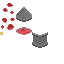

# Example project

Here is a toy project that draws this ugly lava lamp:

<p align="center">
  
</p>

Clone this repo, run `love example`, and contemplate what the 60s must have been like.

`example/res/sheet.png`:



`example/res/quads.lua`, generated with Quadtastic:

```lua
return {
  _META = {
    image_path = "/Users/moritz/Projects/Quadtastic/example/res/sheet.png",
  },
  base = {x = 16, y = 27, w = 16, h = 8},
  bubbles = {
    {x = 2, y = 18, w = 5, h = 5},
    {x = 1, y = 25, w = 3, h = 4},
    {x = 10, y = 18, w = 5, h = 3},
    {x = 7, y = 24, w = 7, h = 6},
    {x = 3, y = 8, w = 5, h = 4},
    {x = 10, y = 11, w = 4, h = 3},
    {x = 7, y = 3, w = 6, h = 4},
  },
  lid = {x = 16, y = 7, w = 16, h = 15},
  liquid = {x = 0, y = 32, w = 3, h = 3},
  stand = {x = 32, y = 32, w = 16, h = 16},
}
```

`example/main.lua`:
```lua
local libquadtastic = require("libquadtastic")

local image, raw_quads, quads, liquid
local bubble_pos
local tube = {x = (400-14) / 2, y = (300 - 30) / 2, w = 14, h = 30}

function love.load()
  love.graphics.setDefaultFilter("nearest", "nearest")

  raw_quads = require("res/quads") -- load raw quad definitions
  image = love.graphics.newImage("res/sheet.png") -- load spritesheet

  -- Create LOVE Quads from raw quad definitions
  quads = libquadtastic.create_quads(raw_quads, image:getWidth(), image:getHeight())
  -- Extract color value from spritesheet. In this case we just extract a single
  -- color, but we could also pass in a table of quads.
  liquid = libquadtastic.create_palette(raw_quads.liquid, image)

  bubble_pos = {}
  for i, raw_bubble in ipairs(raw_quads.bubbles) do
    bubble_pos[i] = {
      x = tube.x + love.math.random(0, tube.w - raw_bubble.w),
      y = 0,
      time_delta = love.math.random(0, 2*math.pi)
    }
  end
end

function love.draw()
  love.graphics.scale(2, 2)
  love.graphics.clear(255, 255, 255)

  love.graphics.draw(image, quads.base, tube.x - 1, tube.y + tube.h - raw_quads.base.h)

  for i=1,#quads.bubbles do
    love.graphics.draw(image, quads.bubbles[i], bubble_pos[i].x, bubble_pos[i].y)
  end

  love.graphics.setColor(liquid)
  love.graphics.rectangle("fill", tube.x, tube.y, tube.w, tube.h)

  love.graphics.setColor(255, 255, 255, 255)
  love.graphics.draw(image, quads.stand, tube.x - 1, tube.y + tube.h - 3)
  love.graphics.draw(image, quads.lid, tube.x - 1, tube.y + 3 - raw_quads.lid.h)
end

function love.update()
  for i, pos in ipairs(bubble_pos) do
    pos.y = math.floor(tube.y + (tube.h/2 - 2) * (1 + math.sin(pos.time_delta + love.timer.getTime() / 4)))
    pos.x = math.floor(tube.x + ((tube.w - raw_quads.bubbles[i].w)/2) * (1 + math.sin(pos.time_delta + love.timer.getTime() / 8)))
  end
end
```
